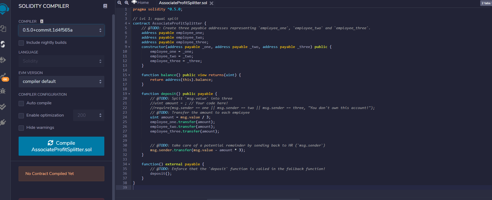
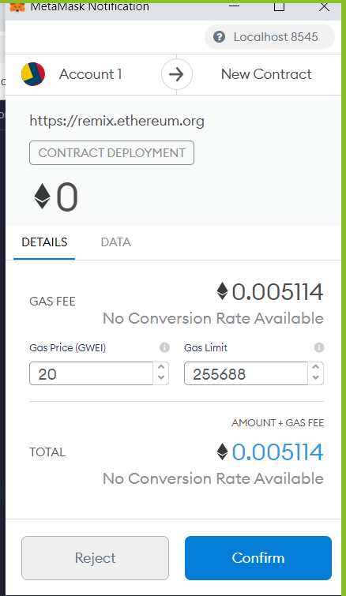
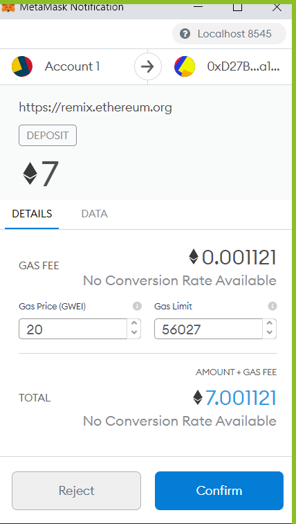

# ProfitSplitting--Smart_Contract

## The Smart Contract

* The smart contract used was written in solidity a language used on the ethereum block chain
* Once written the smart contract must be compiled with proper compiler and will be ready for deployment
* When deploment occurs a comfermation will appear

## Reason for Contract Associate Profit Splitter:

* Contract was created to evenly split profits amonge three partners
* It automatically deposites the split into pre-authorized addresses
* Shows split of 22 ethes deposited into address

